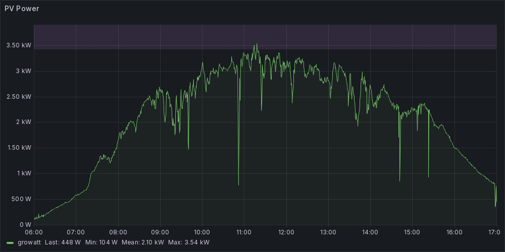
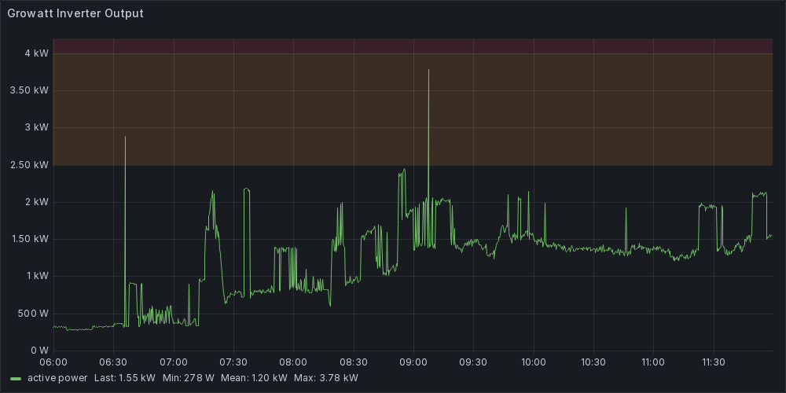
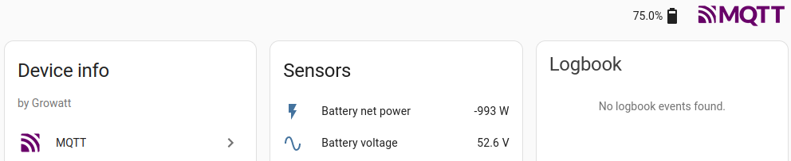

# growatt_exporter

growatt_exporter is a standalone program written in C that can query [Growatt](https://www.growattenergy.com/) solar inverters and output metrics compatible with Prometheus, Grafana, MQTT and Home Assistant.
This allows to monitor PV production, battery status, etc. on a nice Grafana interface.

This has been tested extensively on the [SPF 5000 ES](https://www.growattenergy.com/product/growatt-spf-5000-es-off-grid/) but should work with any product offering a RS485 interface.

## Screenshots





The complete list of sensors can be found in [growatt.h](src/growatt.h).

## Build

### From source

```bash
apt install clang libbsd-dev libconfig-dev libmodbus-dev libmosquitto-dev mosquitto-clients
make
```

### Using Docker

```bash
./docker-build.sh
```

## Install

1. Install runtime dependencies:

`apt install libconfig9 libmodbus5 libmosquitto1`

2. Copy binary:

`cp growatt_exporter /opt/growatt-exporter`

3. Create config file `/etc/growatt-exporter.conf`:

```
device_or_uri = "/dev/ttyUSB0"

prometheus = {
  port = 1234
}

mqtt = {
  host = "10.0.0.1"
  port = 1883
  username = "homeassistant"
  password = "foobar"
}
```

4. Create systemd service file `/etc/systemd/system/growatt-exporter.service`:

```systemd
[Unit]
After=network.target

[Service]
ExecStart=/opt/growatt-exporter /etc/growatt-exporter.conf
Restart=on-failure
RestartSec=10
PrivateTmp=true
ProtectHome=true
ProtectProc=invisible
ProtectSystem=full

[Install]
WantedBy=multi-user.target
```

5. Enable and start systemd service:

`systemctl enable --now growatt-exporter`

## Kudos

The "Growatt OffGrid SPF5000 Modbus RS485 RTU Protocol" PDF document has been a very valuable resource. A copy of it is included in this Git repository. Thank you to the original author for their work.

## Other brands

Would like to monitor Epever/Epsolar Tracer solar charge controllers instead? Here is a sister repository for that: https://github.com/infertux/epever_exporter

## Other approaches

- Blog post: https://www.splitbrain.org/blog/2023-11/03-growatt_and_home_assistant
- Reading Modbus registers via Home Assistant: https://github.com/home-assistant/core/issues/94149
- https://github.com/rspring/Esphome-Growatt

## License

AGPLv3+
